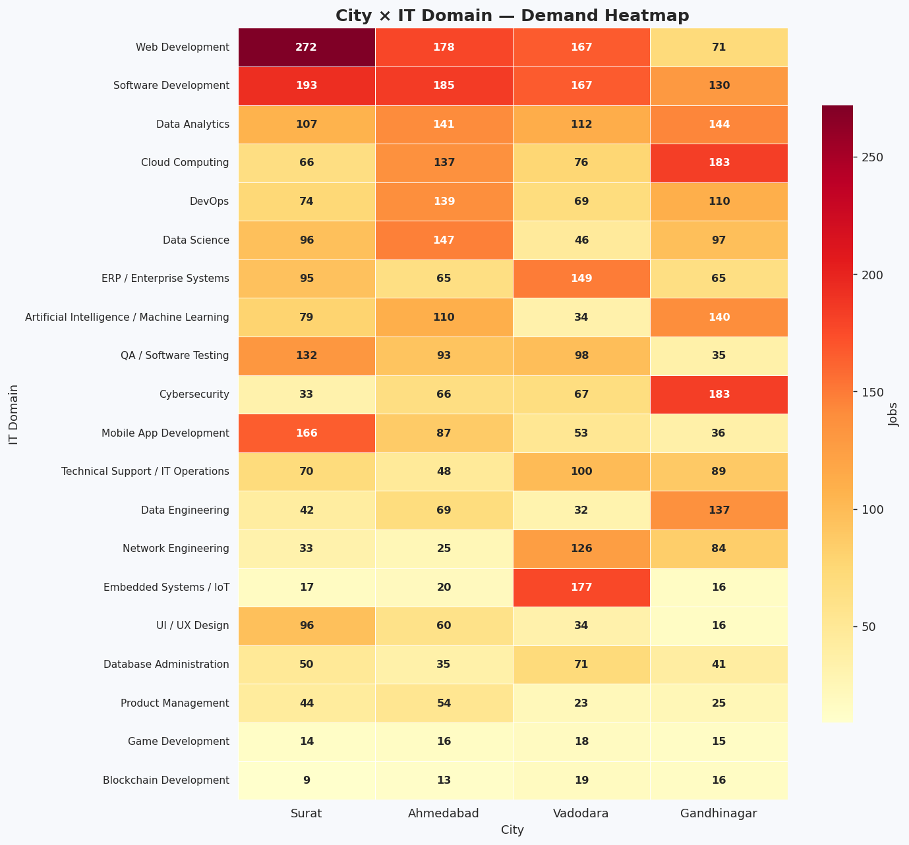
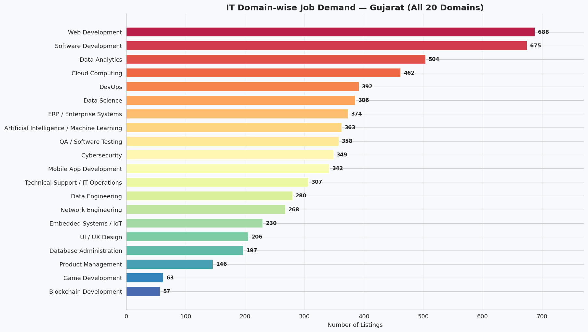
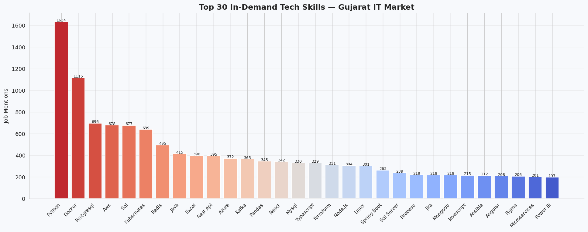
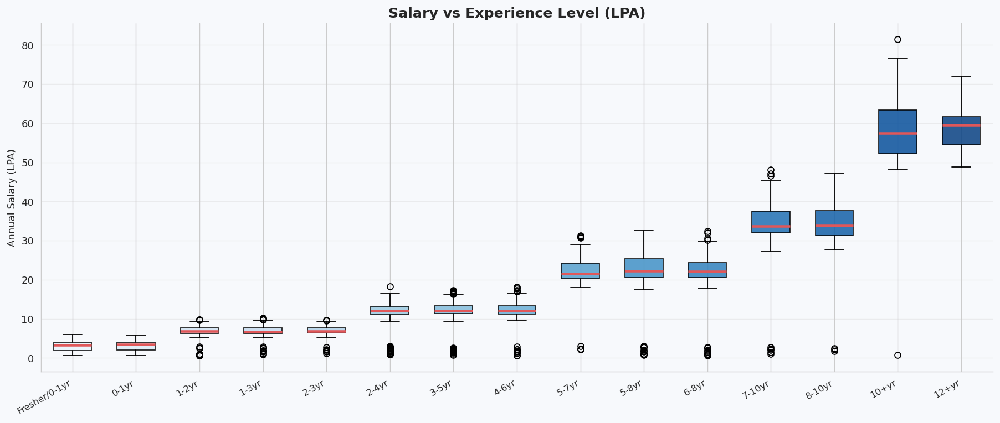

# 🔍 IT Job Market Analysis — Gujarat, India

<div align="center">


> ⚠️ **This project is made for educational and learning purposes only as part of my Final Year Engineering Internship. All data is synthetically simulated. Scraper code is for learning demonstration only — not for actual scraping.**

</div>

---

## 📌 About This Project

Hi! I'm a final year B.Tech student and this is my internship project on **IT Job Market Analysis in Gujarat, India**. The idea was to build a complete data pipeline — from collecting job data to cleaning it, classifying it into IT domains, and finally doing full exploratory data analysis with visualizations.

I built scrapers for **5 job portals**, generated a dataset of **6,647 job listings** across **4 Gujarat cities**, and created **16 charts** to find insights about hiring trends, salary ranges, and skill demand.

**Cities Covered:** Surat · Ahmedabad · Vadodara · Gandhinagar

**Portals Covered:** Naukri · LinkedIn · Indeed · Glassdoor · Internshala

---

## ⚠️ Educational Purpose Notice

```
╔══════════════════════════════════════════════════════════════════╗
║                  ⚠️  FOR EDUCATIONAL USE ONLY                   ║
╠══════════════════════════════════════════════════════════════════╣
║  ✅ Built for learning and internship portfolio                  ║
║  ✅ All data is synthetically generated (not real)              ║
║  ✅ Scraper code is for learning demonstration only             ║
║  ✅ No real user or company data is stored                      ║
║  ❌ Do NOT run scrapers on live websites without permission     ║
║  ❌ Always check robots.txt and Terms of Service first          ║
╚══════════════════════════════════════════════════════════════════╝
```

---

## 🔄 Project Flow

```
5 Platform Scrapers
(Naukri, LinkedIn, Indeed, Glassdoor, Internshala)
           ↓
Individual CSV per Portal
           ↓
Merge All CSVs → 12-Step Cleaning Pipeline
           ↓
Auto Domain Classification (20 IT Domains)
           ↓
Exploratory Data Analysis (16 Charts)
           ↓
Insights & Findings Report
```

---

## 🏗️ Project Architecture

```
┌─────────────────────────────────────────────────┐
│           DATA COLLECTION LAYER                 │
│                                                 │
│  Naukri        → requests + BeautifulSoup       │
│  LinkedIn      → Selenium WebDriver             │
│  Indeed        → Selenium WebDriver             │
│  Glassdoor     → Selenium WebDriver             │
│  Internshala   → requests + BeautifulSoup       │
└──────────────────────┬──────────────────────────┘
                       ↓
┌─────────────────────────────────────────────────┐
│              DATA STORAGE LAYER                 │
│                                                 │
│  naukri_jobs.csv        (~1,428 records)        │
│  linkedin_jobs.csv      (~1,125 records)        │
│  indeed_jobs.csv        (~1,199 records)        │
│  glassdoor_jobs.csv     (~1,102 records)        │
│  internshala_jobs.csv   (~1,793 records)        │
│  final_merged_jobs.csv  ( 6,647 records) ✅     │
└──────────────────────┬──────────────────────────┘
                       ↓
┌─────────────────────────────────────────────────┐
│            DATA PROCESSING LAYER                │
│                                                 │
│  base_data.py + merge_and_clean.py              │
│  ├── normalize_city()    → Fix city names       │
│  ├── standardize_skills()→ Fix skill names      │
│  ├── parse_experience()  → String → Number      │
│  ├── normalize_salary()  → String → INR         │
│  ├── classify_domain()   → 20 IT domains        │
│  └── deduplicate()       → Remove duplicates    │
└──────────────────────┬──────────────────────────┘
                       ↓
┌─────────────────────────────────────────────────┐
│         EXPLORATORY DATA ANALYSIS LAYER         │
│                                                 │
│  analysis_v2.ipynb / analytics.py               │
│  → 16 charts covering city, domain,             │
│    salary, skills, portals, experience          │
└──────────────────────┬──────────────────────────┘
                       ↓
┌─────────────────────────────────────────────────┐
│               INSIGHTS LAYER                    │
│  → City specialisations, top skills,            │
│    salary bands, fresher opportunities          │
└─────────────────────────────────────────────────┘
```

---

## 📁 Project Structure

```
it-market-job-data-analysis/
│
├── scraper/
│   ├── base_data.py              ← Shared data pools & helper functions
│   ├── naukri_scraper.py         ← Naukri scraper (requests + BS4)
│   ├── linkedin_scraper.py       ← LinkedIn scraper (Selenium)
│   ├── indeed_scraper.py         ← Indeed scraper (Selenium)
│   ├── glassdoor_scraper.py      ← Glassdoor scraper (Selenium)
│   ├── internshala_scraper.py    ← Internshala scraper (requests + BS4)
│   └── merge_and_clean.py        ← Runs all scrapers, merges & cleans
│
├── data/
│   ├── naukri_jobs.csv
│   ├── linkedin_jobs.csv
│   ├── indeed_jobs.csv
│   ├── glassdoor_jobs.csv
│   ├── internshala_jobs.csv
│   └── final_merged_jobs.csv     ← Main dataset (6,647 records)
│
├── analysis/
│   ├── analysis_v2.ipynb         ← EDA Notebook (16 charts) ← USE THIS
│   └── analytics.py              ← EDA Python script
│
├── visualizations/               ← All 16 generated charts
├── requirements.txt
├── .gitignore
└── README.md
```

---

## 🌐 Portal Overview

| Portal | Method | Focus | Records |
|--------|--------|-------|---------|
| Naukri | requests + BeautifulSoup | Mid & Senior IT roles | ~1,428 |
| LinkedIn | Selenium WebDriver | MNCs & senior roles | ~1,125 |
| Indeed | Selenium WebDriver | All levels, diverse | ~1,199 |
| Glassdoor | Selenium WebDriver | Enterprise + salary data | ~1,102 |
| Internshala | requests + BeautifulSoup | Freshers & Internships | ~1,793 |
| **Total** | | | **6,647** |

---

## 🕷️ Scraping Techniques Used

```python
# Naukri & Internshala — Static HTML (requests + BeautifulSoup)
import requests
from bs4 import BeautifulSoup

response = requests.get(url, headers=headers, timeout=15)
soup     = BeautifulSoup(response.text, "html.parser")
cards    = soup.find_all("article", class_="jobTuple")
title    = cards[0].find("a", class_="title").get_text(strip=True)

# LinkedIn, Indeed, Glassdoor — JS Pages (Selenium)
from selenium import webdriver
from selenium.webdriver.common.by import By

options = webdriver.ChromeOptions()
options.add_argument("--headless")   # no browser window
driver  = webdriver.Chrome(options=options)
driver.get(url)
driver.execute_script("window.scrollTo(0, document.body.scrollHeight);")
title = driver.find_element(By.CLASS_NAME, "job-title").text
driver.quit()

# Polite scraping — always add delay
import time, random
time.sleep(random.uniform(2, 4))
```

---

## 🏷️ Domain Classification

Every job is auto-classified into 1 of 20 IT domains using keyword matching:

```python
def classify_domain(job_title, skills):
    combined = f"{job_title} {skills}".lower()
    for domain, keywords in DOMAIN_KEYWORDS.items():
        for kw in keywords:
            if re.search(r'\b' + re.escape(kw) + r'\b', combined):
                return domain
    return "Software Development"
```

| Domain | Keywords Used |
|--------|--------------|
| AI / ML | TensorFlow, PyTorch, NLP, LLM |
| Data Science | scikit-learn, R, Statistics |
| Data Engineering | Spark, Kafka, Airflow, dbt |
| Data Analytics | Power BI, Tableau, Looker |
| Web Development | React, Node.js, Django, PHP |
| Mobile App Dev | Flutter, Kotlin, Swift |
| DevOps | Docker, Kubernetes, Terraform |
| Cloud Computing | AWS, Azure, GCP |
| Cybersecurity | VAPT, CEH, Ethical Hacking |
| + 11 more domains | ... |

---

## 📊 EDA — Charts Generated

| # | Chart | What It Shows |
|---|-------|--------------|
| 01 | Platform Comparison | Jobs per portal |
| 02 | City Distribution | Bar + pie per city |
| 03 | Domain Hiring Trends | All 20 IT domains ranked |
| 04 | City × Domain Heatmap | Which domain is hot in which city |
| 05 | Portal × Domain Heatmap | Which portal posts which domain |
| 06 | Top 30 Tech Skills | Most in-demand skills |
| 07 | Skills per City | 4-panel city skill breakdown |
| 08 | Job Type Distribution | Full-time vs Intern vs Contract |
| 09 | Job Type per City | Breakdown by city |
| 10 | Salary Distribution | Boxplots by city & domain |
| 11 | Salary vs Experience | How salary grows with exp |
| 12 | Experience Distribution | Fresher to senior breakdown |
| 13 | Top 25 Companies | Most hiring companies |
| 14 | Internship Analysis | Intern market by city & domain |
| 15 | Salary Heatmap | Median salary city × domain |
| 16 | Jobs Over Time | Daily + 7-day avg posting trend |

---

## 📊 Sample Visualizations

### City × Domain Heatmap


### Domain Hiring Trends


### Top 30 Tech Skills


### Salary vs Experience


---

## 💡 Key Findings

- **Ahmedabad** leads Gujarat in IT hiring — strongest in AI/ML, DevOps & Cloud
- **Surat** dominates Web Development & Mobile App roles
- **Vadodara** has highest demand for Embedded Systems & ERP
- **Gandhinagar** leads in Cybersecurity & Data Engineering (GIFT City effect)
- **Python** is #1 most demanded skill across all 4 cities
- **Web Development** is the most posted domain overall
- **1,078 internships** available — Ahmedabad & Surat best for freshers
- **Median salary** across all roles is ₹7.6 LPA
- AI/ML and Cloud roles offer highest salary bands (₹14–45 LPA)

---

## 🚀 How to Run

```bash
# 1. Clone repo
git clone https://github.com/Jayr1612/it-market-job-data-analysis.git
cd it-market-job-data-analysis

# 2. Install dependencies
pip install -r requirements.txt

# 3. Run full pipeline (generates all CSVs)
python scraper/merge_and_clean.py

# 4. Run EDA (generates all charts)
python analysis/analytics.py
```

**Or just open `analysis/analysis_v2.ipynb` in Google Colab** and upload `final_merged_jobs.csv` — easiest way! ✅

---

## 🛠️ Libraries Used

| Library | Purpose |
|---------|---------|
| `requests` | HTTP requests for static pages |
| `BeautifulSoup4` | HTML parsing |
| `Selenium` | Browser automation for JS pages |
| `Pandas` | Data cleaning & analysis |
| `NumPy` | Numerical operations |
| `Matplotlib` | Charts & visualizations |
| `Seaborn` | Statistical plots & heatmaps |
| `re` | Regex for text parsing |
| `hashlib` | Deduplication fingerprinting |
| `datetime` | Date handling |

---

## 🔮 Future Ideas

- [ ] Live scraping with real data
- [ ] Streamlit dashboard
- [ ] Salary prediction ML model
- [ ] Job demand forecasting

---

## 👨‍💻 About Me

**Jayr — Final Year B.Tech Student**
Built this project during my Data Analytics Internship to learn
end-to-end data engineering and analysis.

- 🐙 GitHub: [@Jayr1612](https://github.com/Jayr1612)

---

## 📝 Disclaimer

```
This project was made for learning purposes only.
All data is synthetically generated — not real job market data.
Scraper code is for educational reference only.
Please do not use it to scrape any website without permission.
```

---

<div align="center">

*Made with ❤️ as part of Data Analytics Internship — Gujarat, India 🇮🇳*

⭐ Star if you found this helpful!

</div>
